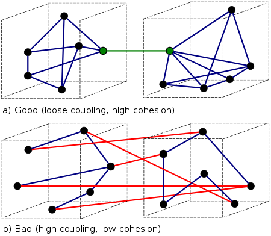

# Связность(coupling) и зацепление (coupling)

Зацепление модулей (coupling), часто называемую зацеплением, характеризует степень независимости модулей.

Связность (cohesion) характеризует целостность, «плотность» модуля, т.е. насколько модуль является простым с точки зрения его использования.

[Википедия](https://ru.wikipedia.org/wiki/%D0%97%D0%B0%D1%86%D0%B5%D0%BF%D0%BB%D0%B5%D0%BD%D0%B8%D0%B5_(%D0%BF%D1%80%D0%BE%D0%B3%D1%80%D0%B0%D0%BC%D0%BC%D0%B8%D1%80%D0%BE%D0%B2%D0%B0%D0%BD%D0%B8%D0%B5))

Типы зацепления, согласно стандарту ISO/IEC/IEEE 24765-2010:

- зацепление по общей области (common-environment coupling, common coupling);
- зацепление по содержимому (content coupling);
- зацепление по управлению (control coupling);
- зацепление по данным (data coupling, input-output coupling);
- смешанное зацепление (hybrid coupling);
- патологическое зацепление (pathological coupling).

