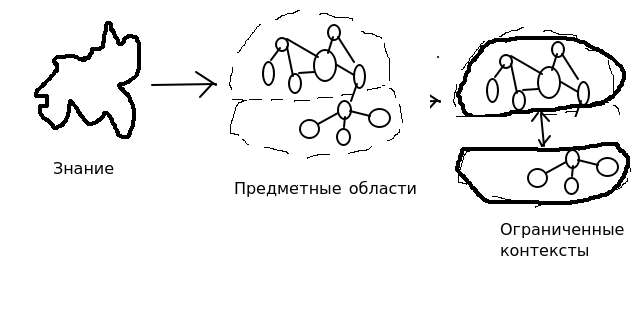

# Предметно ориентированное программирование

Кажется, что разделение на предметные области может служить основой для структуризации бизнеса. Выделение предметных
областей - это регулярная работа. Во время выполнении задачи, сотрудник (менеджер, программист) должен
ясно понимать, внутри какой ПО он находится. Разбиение на ПО может служить основой для 
классификации статей в wiki. 

[Заметки по книге Вон-Венона](DDD-von-venon.md)

[Анемия](Anemia.md)

[Ограниченный контекст]()

[Единый язык](ubuqutios-language.md)
