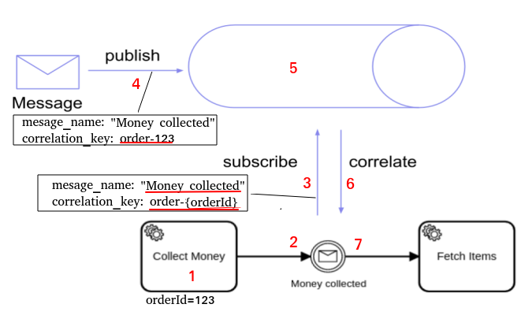
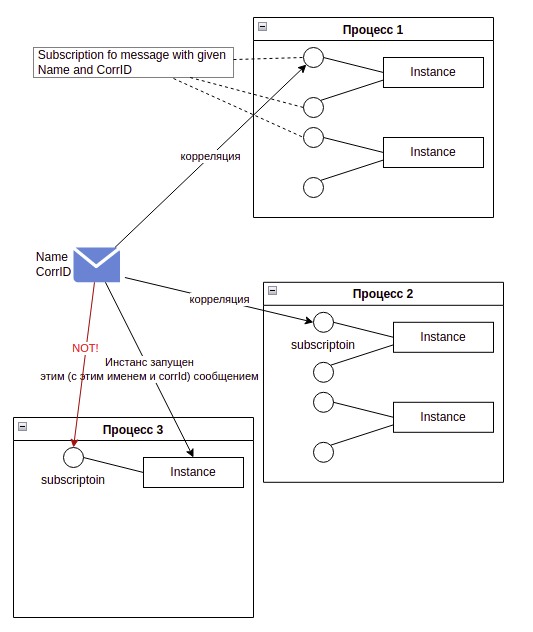

# Основы Camunda

# Что такое Camunda Cloud?
Camunda Cloud - это Saas, для оркестрации микросервисов
  - гарантрированность выполнения процесса
  - аудит, логи
Облако 
  - обладает высокой доступностью и устойчивостью к ошибкам
  - предлагает кластеры различного размера

**Обеспечивает**
  - Отслеживаемость процессов между микросервисами
  - оркестрация
  - мониторинг зависших процессов и ошибок

**Метрики качества**
 - горизонтальная масштабируемость. [Каждый инстанс] Zeebe  пишет данные в своею файловую систему
 - доступность и устойчивость к ошибкам. Механизм репликции позволяет [zeebe] подниматься после отказа машины без потери данных.
В целом система при этом остается доступной.
 - Все действия по процессу пишутся в append-only лог
 - Reactive publish-subscribe interaction model...
 - Описание процессов на  ISO-standard BPMN 2.0
 - Клиент независим от ЯП

## Процессы
 - BPMN 2.0
 - Создание и редактирование с  BPMN modeler
 - Процесс хранит данные. Воркер моежт их изменять
 - Процесс может ветвиться и паралелится
 - Может получать и источать события

# Воркеры
 **Параметры задачи**
- тип
- загловки
- ключ процесса
- Переменные

Воркеры запрашивают у зиби, есть ли у них работа, с определенным интервалом (настройки клиента)
При запросе задачи,воркер может установить
 - свой идентификатор (для аудирования)
 - таймаут. За какое время он обязуется выполнить работу
 - сколько задать брать за один запрос
 - какие переменные процесса запрашивать. По умолчанию - все переменные процесса

**Long polling**
- когда вместо последовательных запросов делается один, он открывает соединение и ждет, пока появится работа.

Воркеры
 - не обязаны быть постояннно доступными
 - сами контролируют, сколько запросов они готовы переварить

Если мы файлим джобу с нулем попыток, то генерируется инцедент и джоба встает

**Воркеры должны быть идемпотентными.** Даже если ворекер имеет несколько инстансов

Вся эта система очень похоже на конвейер с рабочими

# Создание экземпляров процесса
- C помощью команд
  - Асинхронный  запуск. Пример:
    ```
    zbctl create instance "order-process"
    ```
  - Синхронный запуск ( дождаться результата).    

- Через события
- По таймеру


# Сообщения



Процесс доходит до meesage сatсh еvent и подписывается. Он говорит, какое сообщение
(имя + correlationId). Далее сообщение приходит в шину, и отдается процессу.
После этого процесс закрывает подписку.

**Буфферизация**
Если сообщение послаать до того, как оформить подписку, то 
зиби не примет сообщение. Но можно включить буфферизацию, тогда сообщение будет принято
 и ждать, пока на него не подпишутся, либо, пока не истечет ttl

**Message cardinality**




**Id сообщения**

Возможны несколько сообщений с одинаковым именем и corrID. Для их различения можно 
назначить сообщение ID. Два сообщения с одинаковыми именем и corrID и ID не могут 
одновременно попасть в буфер.
```
zbctl publish message "Money collected" --correlationKey "order-123" --messageId "tracking-12345"
```

# Инциденты

- Не удалось выполнить задачу, и новых попыток не дано
- Процесс не имеет необходимых переменных для выполения шага (задачи, ветвления)

Дока говорит, что на nullPointer и подобный ошибки инцеденты не поднимаются. Но у меня поднялся

Разрешение инцедентов
 - устраните проблему
 - отметьте инцедент как решенный. Это триггернет процесс
 - если проблема не решена, будет поднят следующий инцедент
 - можно таже изменить переменны процесса, чтобы задача смогла быть выполнена


# Переменные
# ExpressionLanguage


