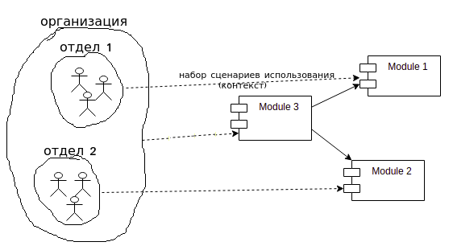

# Принцип единой ответственности

Формулировка из книги Чистая Архитектура:

**Модуль должен иметь единственную причину для изменения.**
 - модуль - обычно это класс
 - причина - это заказчик, человек или группа людей

Иными словами можно переформулировать так: У класса должен быть единственный, четко определенный заказчик.

[Статья на хабре к прочтению](https://habr.com/ru/post/465507/) 

Привет. Мы делаем реализацию возвратов через поручение на возврат. Сейчас проектная работа по большей части завершена,  
в ближайшее время начнем реализовывать. 
За работу с поручением будет отвечать отдельный сервис. В нем будет создаваться это поручение, будут выполняться
и отслеживаться операции с поручением. Фактически, этот сервис будет реализовывать возвратную логику, которая сейчас находится в paybox. 
Сервис будет использовать bpmn. Архитектура - здесь https://drive.google.com/file/d/1-3_ZHtufJ75ZszSy70n4M3ouktERQEVa/view.

Сейчас бизнес хочет новый функционал по возвратам довольно срочно, и есть риск затянуть с этим из-за сложностей развертывания нового сервера.
У нас devops работу последние годы брал на себя ты, и мы можем столкнуться с трудностями.

Какие я вижу варианты для того, чтобы быстрее выкатится
 - сделать временно раскладку через gitlab-ci
 - временно воткнуть новый функционал в ticketsale, и воспользоваться его разверткой
В любом случае, нужно твое одобрение и помощь.

Такая вводная, звони, обсудим, расскажем.

