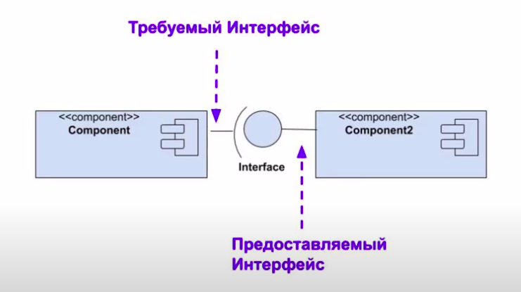
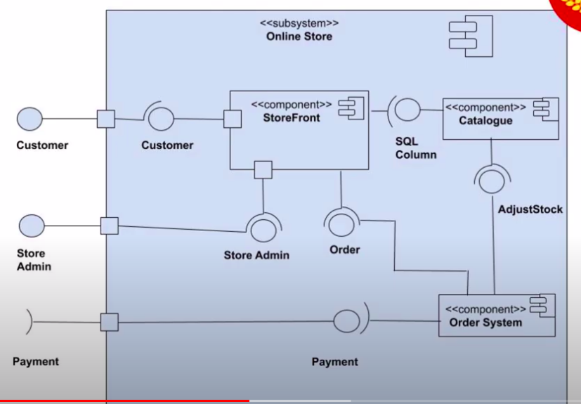
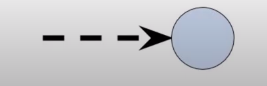

#Диаграммы компонентов (справочник)

Используются для 
- моделирования физических аспектов объектно-ориентированных систем,
- статического представления реализации системы

**Компоненты и интерфейсы

**Подсистема** - особый выд компонента. За одно на рисунке 
и пример диаграммы (онлайн магазина)

**Порт** используется для предоставления требуемых и предоставляемых 
интерфейсов компонента

##Отношения
**Ассоциация** определяет семантические отношения, которые могут возникать 
между экземплярами

**Агрегация** - один элемент является частью второго

**Композиция** - в данном случае сильная форма агрегации, которая требует, чтобы экземляр
включался не более чем в один компонент за раз. Если составная часть удаляется
 то обычно все ее части удаляются тоже.

**Ограничения** - условие или ограничение, выраженное в тексте на естественном языке, для 
обозначения некоторой семантики элемента

**Зависимость** это отношение, которое означает, что для спецификации или реализации отдельного 
элемента или набора элементов требуются другие элементы. Это означает, что полная семантика
зависимых элементов либо семантически, либо структурно зависит от элементов поставщика.

