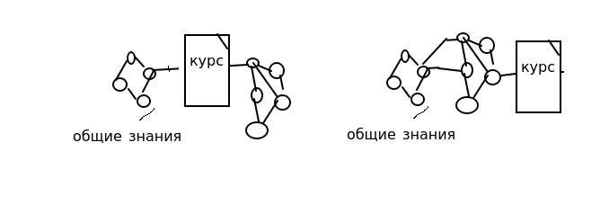

# 

Сейчас процесс получения новых знаний основан на идеи курса (учебника, блока знаний), и идеи 
компетенции (выучил курс, сдал). В результате система понятий получается неправильно связана:

Учебник должен лишь служить экскурсией в область знаний, а результат - встраивание понятий из него в общую систему
Вместо этого учебники пытаются писать как можно более изолировано, чтоб его мог прочитать любой, 
независимо от знаний в других областях. 
Вывод:
 - не важно, как ты сдал курс, важно, сколько понятия ты взял из него и пользуешься
 - возможно, надо переходить от классического образования к обучению на производстве. Это значит,
что ребенок лет с 10 должен не готовиться к ЕГЭ, а работать на правах этакого джуниора. Даже в науке. Хочешь
быть профессором - приходи в лаборатории и пусть тебя учат сотрудники. Делать эксперименты, вести журналы,
обрабатывать результаты, читать статьи.

